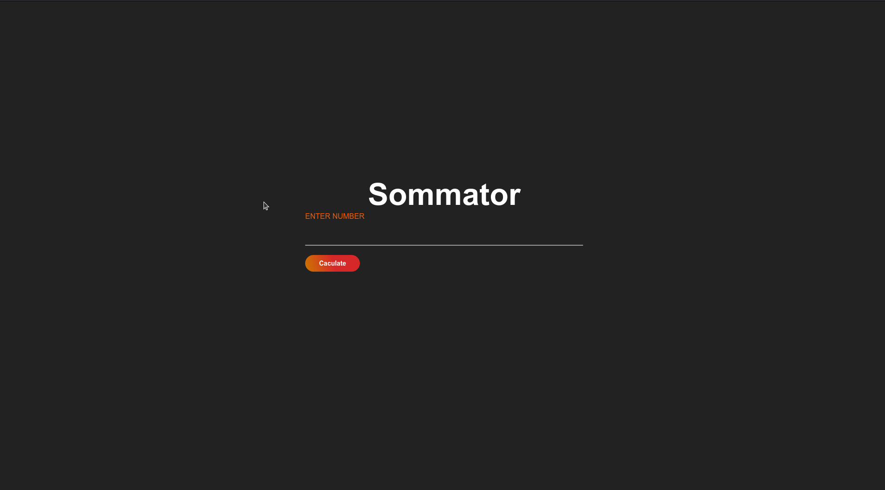

# Summator

**Summator** is a simple web app that counts from 1 to a user-specified number, with custom CSS for a clean design.

## How to Use

- Access the app [here](https://summator.vercel.app/)
- Or clone the repo:
   ```bash
   git clone https://github.com/YOUR_USERNAME/Summator.git
   ```
   Open `index.html` in a browser.

## Tech Used

- HTML
- CSS
- JavaScript


